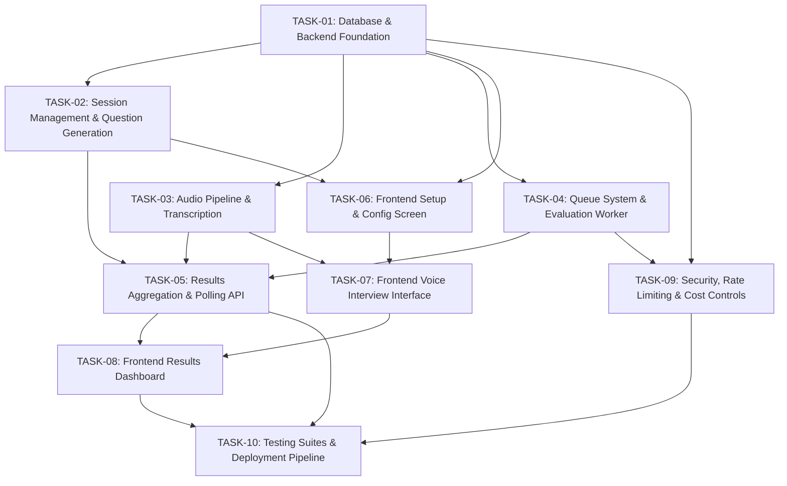

# Mock Interview Application - Implementation Task Roadmap

This directory contains the detailed, actionable task specifications for building the **Mock Interview Application** based on the [Technical Specification](../documents/Mock%20Interview%20Application_%20Technical%20Specification.md).

---

## 1. Project Overview & Architecture Reference

The Mock Interview Application is an AI-driven interview preparation tool that accepts a candidate's Resume and Job Description (JD), asks targeted questions via voice, transcribes answers using in-process `faster-whisper`, asynchronously evaluates them via an Azure Function worker using Azure OpenAI `gpt-4o-mini`, and renders a comprehensive performance dashboard.

### Core Architecture Components

| Component | Technology | Hosting Target |
| :--- | :--- | :--- |
| **Frontend** | React (Vite, TypeScript, Tailwind CSS) | Azure Static Web Apps (Free tier) |
| **Backend API** | Python 3.11+, FastAPI, Pydantic v2 | Azure Container Apps (Free grant, scale-to-zero) |
| **STT Engine** | `faster-whisper` (`base.en`, int8 CPU) | In-process within FastAPI container |
| **Database** | PostgreSQL | Supabase Free Tier |
| **Message Queue** | Azure Storage Queues (`evaluation-jobs`) | Azure Storage Account |
| **Background Worker** | Azure Functions (Python v2 model) | Azure Consumption Plan |
| **LLM Provider** | Azure OpenAI (`gpt-4o-mini`) | Serverless Pay-as-you-go |

---

## 2. Milestone & Task Dependency Matrix

---

## 3. Task Breakdown Summary

| Task ID | Title | Milestone | Primary Deliverable |
| :--- | :--- | :--- | :--- |
| [**TASK-01**](./TASK-01-database-and-backend-foundation.md) | Database Schema & Backend Foundation | M1 | Supabase migrations, FastAPI app skeleton, config, and DB client |
| [**TASK-02**](./TASK-02-session-management-and-question-generation.md) | Session Management & Question Generation | M1 | Resume/JD parsing, prompt builder, `POST /sessions`, `POST /sessions/{id}/end` |
| [**TASK-03**](./TASK-03-audio-recording-and-transcription-pipeline.md) | Audio Ingestion & Transcription Pipeline | M2 | `faster-whisper` integration, jargon prompting, `POST /sessions/{id}/answers` |
| [**TASK-04**](./TASK-04-evaluation-worker-and-queue-system.md) | Asynchronous Evaluation Worker & Queue | M3 | Azure Storage Queue producer, Azure Function evaluator, poison queue handler |
| [**TASK-05**](./TASK-05-results-aggregation-and-polling-api.md) | Results Aggregation, Polling & Session API | M3 | `GET /sessions/{id}/results`, `POST /answers/{id}/retry`, `DELETE /sessions/{id}` |
| [**TASK-06**](./TASK-06-frontend-core-and-configuration-screen.md) | Frontend Core Setup & Session Configuration | M1 | React + Vite scaffold, resume/JD upload UI, difficulty & topic selectors |
| [**TASK-07**](./TASK-07-frontend-interview-interface.md) | Voice Recording & Interactive Interview Screen | M2 | MediaRecorder with Opus audio, timer/VU-meter, text fallback, answer submission |
| [**TASK-08**](./TASK-08-frontend-results-dashboard.md) | Results Dashboard, Scoring & Critique UI | M4 | Polling state engine, STAR breakdown cards, technical depth radar, retry UI |
| [**TASK-09**](./TASK-09-security-rate-limiting-and-cost-controls.md) | Security, Rate Limiting & Cost Controls | M4 | IP rate limiting, token budget guards, scale-to-zero ACA config, budget alerts |
| [**TASK-10**](./TASK-10-testing-strategy-and-deployment.md) | Testing Strategy, Quality Benchmarks & CI/CD | M5 | Unit/Integration tests, STT jargon accuracy benchmark, Playwright E2E, deployment scripts |

---

## 4. Requirements Traceability Matrix

| Spec Requirement | Covered In Tasks |
| :--- | :--- |
| **FR-1**: Paste/upload Resume & JD (PDF/DOCX extraction) | [TASK-02](./TASK-02-session-management-and-question-generation.md), [TASK-06](./TASK-06-frontend-core-and-configuration-screen.md) |
| **FR-2**: Select difficulty & include/exclude topics | [TASK-02](./TASK-02-session-management-and-question-generation.md), [TASK-06](./TASK-06-frontend-core-and-configuration-screen.md) |
| **FR-3**: System generates question 1 dynamically | [TASK-02](./TASK-02-session-management-and-question-generation.md) |
| **FR-4**: Audio capture, transcription & persistence | [TASK-03](./TASK-03-audio-recording-and-transcription-pipeline.md), [TASK-07](./TASK-07-frontend-interview-interface.md) |
| **FR-5**: Non-blocking next question return | [TASK-03](./TASK-03-audio-recording-and-transcription-pipeline.md), [TASK-04](./TASK-04-evaluation-worker-and-queue-system.md) |
| **FR-6**: Contextual question progression without loops | [TASK-02](./TASK-02-session-management-and-question-generation.md), [TASK-03](./TASK-03-audio-recording-and-transcription-pipeline.md) |
| **FR-7**: End interview flow (user action or max cap) | [TASK-02](./TASK-02-session-management-and-question-generation.md), [TASK-07](./TASK-07-frontend-interview-interface.md) |
| **FR-8**: Results dashboard with STAR, technical depth, suggestions | [TASK-05](./TASK-05-results-aggregation-and-polling-api.md), [TASK-08](./TASK-08-frontend-results-dashboard.md) |
| **FR-9**: Polling progress, status flags, and retry | [TASK-04](./TASK-04-evaluation-worker-and-queue-system.md), [TASK-05](./TASK-05-results-aggregation-and-polling-api.md), [TASK-08](./TASK-08-frontend-results-dashboard.md) |
| **FR-10**: Re-record and transcript preview before submission | [TASK-07](./TASK-07-frontend-interview-interface.md) |
| **NFR**: Sub-8s p95 latency | [TASK-03](./TASK-03-audio-recording-and-transcription-pipeline.md) |
| **NFR**: Zero / near-zero operating cost | [TASK-01](./TASK-01-database-and-backend-foundation.md), [TASK-09](./TASK-09-security-rate-limiting-and-cost-controls.md) |
| **NFR**: Audio privacy (discard audio post-STT) | [TASK-03](./TASK-03-audio-recording-and-transcription-pipeline.md), [TASK-09](./TASK-09-security-rate-limiting-and-cost-controls.md) |
| **NFR**: Observability & testing | [TASK-09](./TASK-09-security-rate-limiting-and-cost-controls.md), [TASK-10](./TASK-10-testing-strategy-and-deployment.md) |
